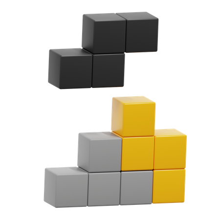

# Tetris-Optimizer




#### This program will assemble a tetrominoes given in the data.txt file for trying to create the smallest square possible.

## Usage
```bash
go run . "data.txt"
```

```
Example

input:
....
....
..##
..##

output:
##
##
```
The project contains a test file that consist of good and bad examples.

## Author
Emran Marei 
[@emarei](www.github.com/iemran93/)